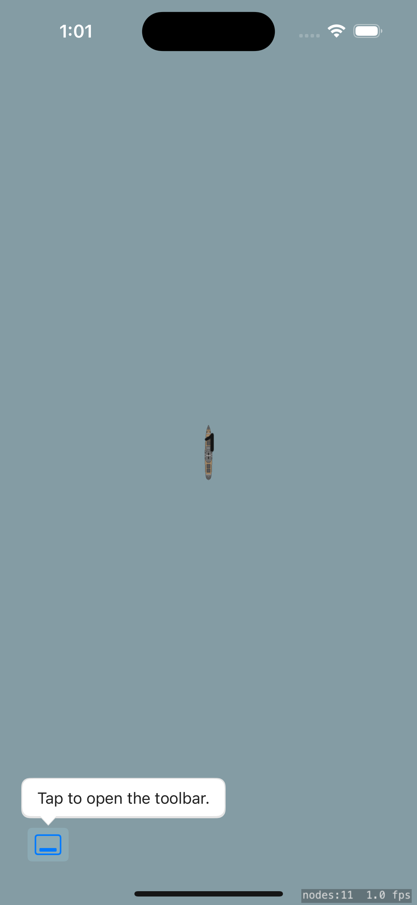
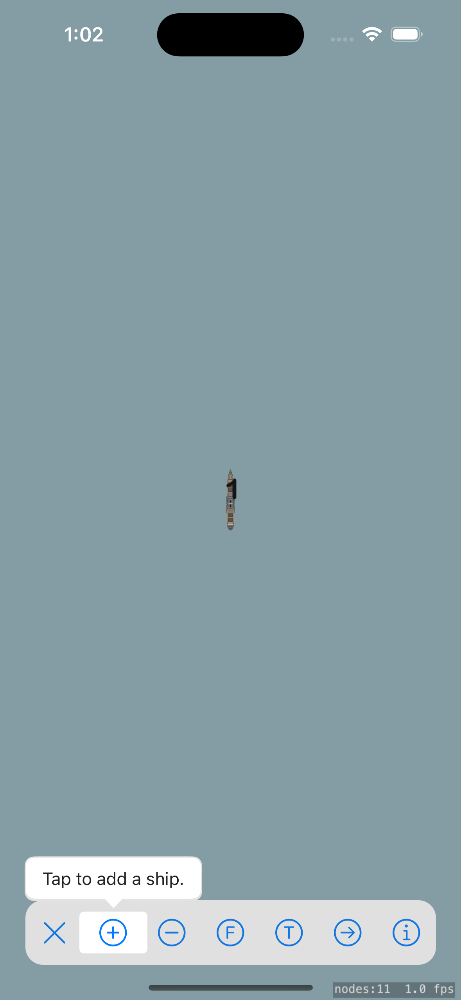
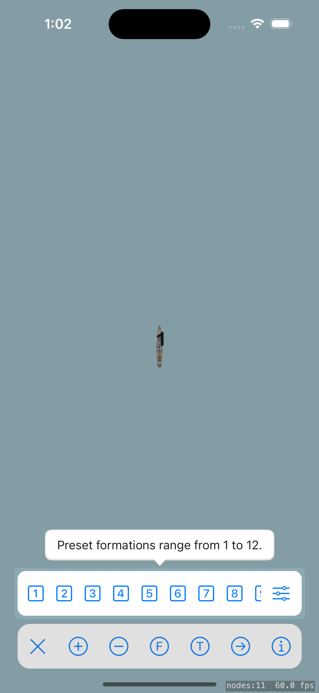
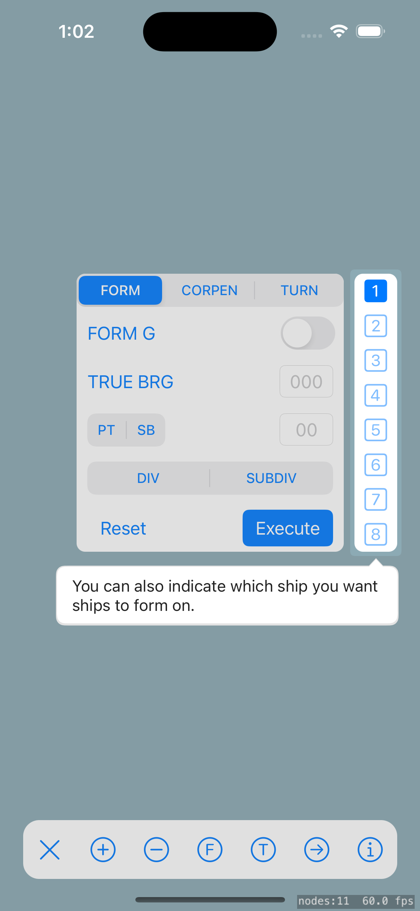
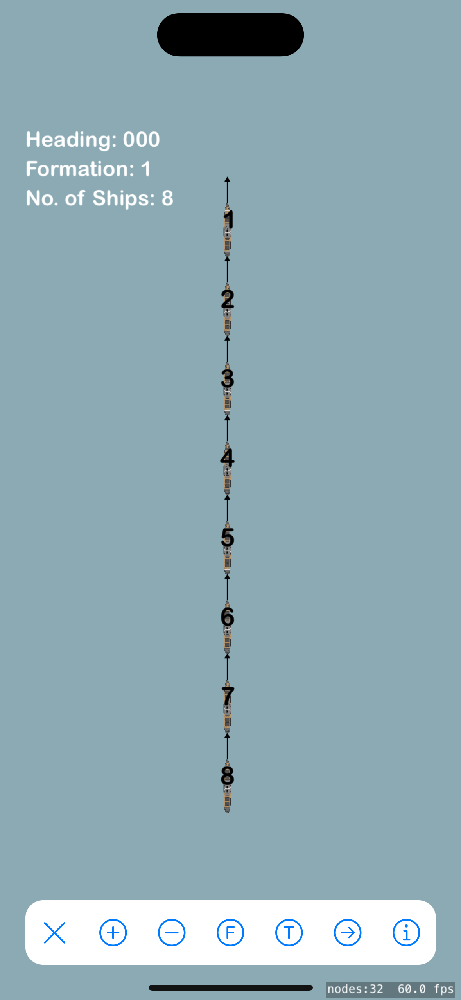
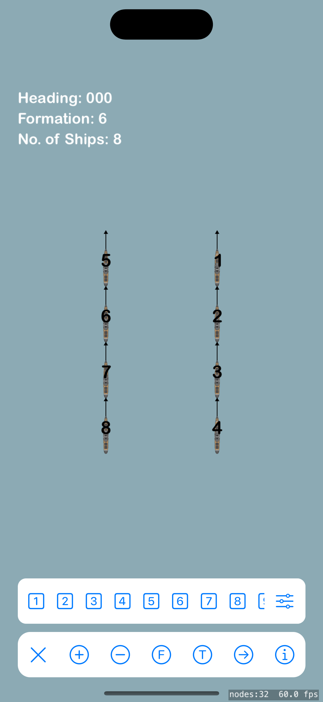
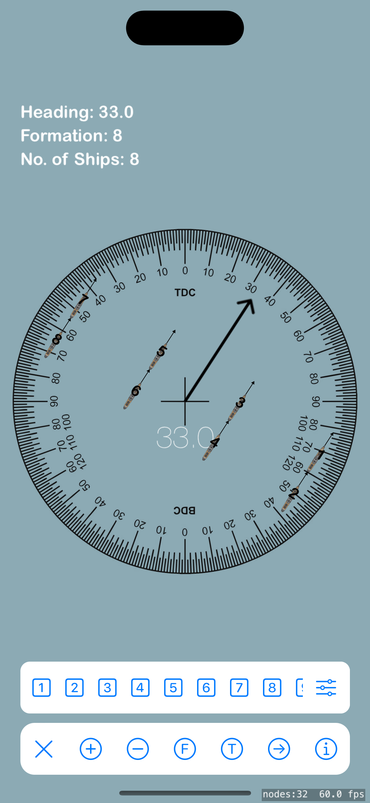
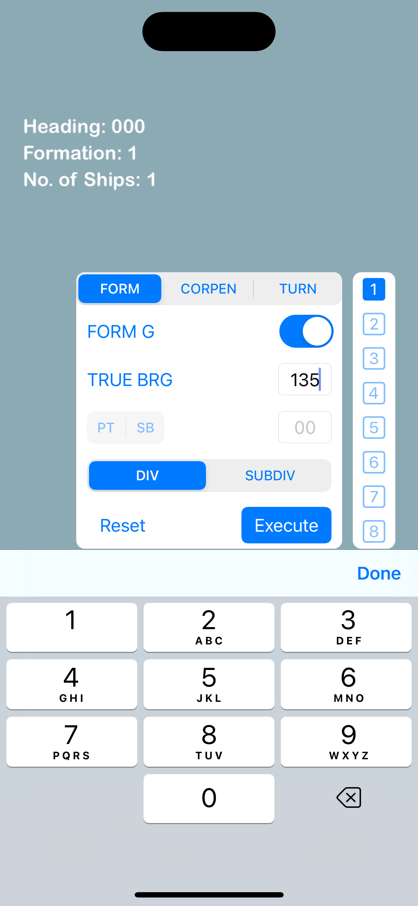

#  Manex

An iOS app made to help quickly visualize formation changes between ships and changes in relative velocity 
(RelVel), built with UIKit, SpriteKit and the Instructions library. 

It aims to reduce the time taken to calculate formation changes and relvel by hand. 

## Supported Functions

- Add/remove ships from the formation
- 360º free hand rotation to align to any heading
- Calculate new formation after each signal execution 
- Formation Presets: 1 to 12
- FORM commands, including:
  - FORM [000-359]
  - FORM [PT/SB] [0-18]
  - FORM [000-359] [DIV/SUBDIV]
  - FORM G [DIV/SUBDIV] [000-359]
  - FORM G [DIV/SUBDIV] [PT/SB] [0-18]
- CORPEN commands, including:
  - CORPEN [000-359]
  - CORPEN D [000-359]
- TURN commands, including: 
  - TURN [PT/SB] [1-18]
  - TURN [000-359]

## Examples

 
